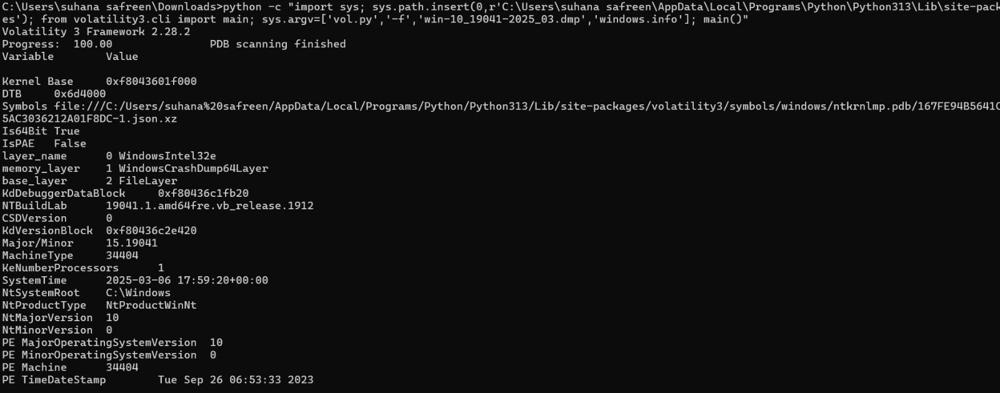
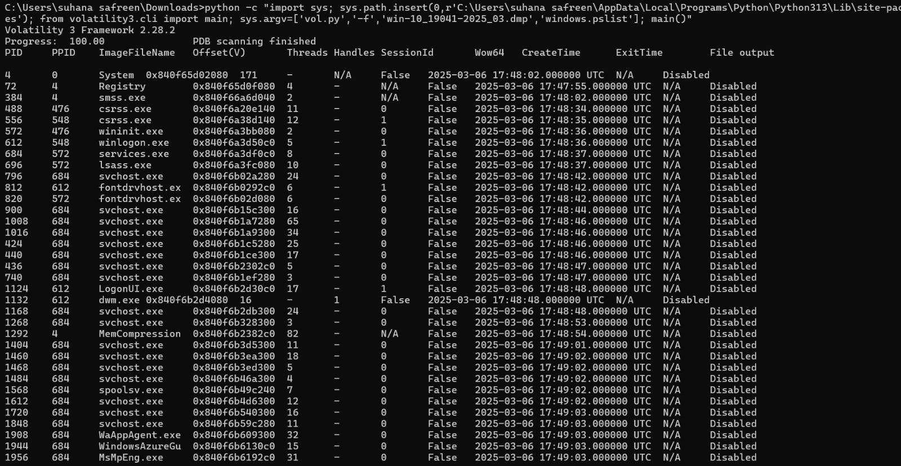
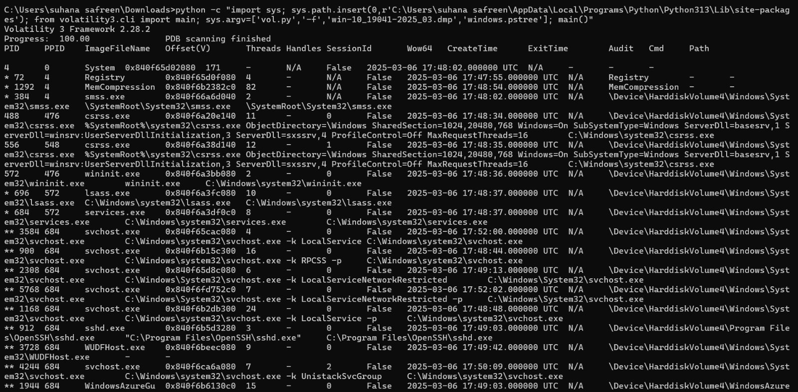
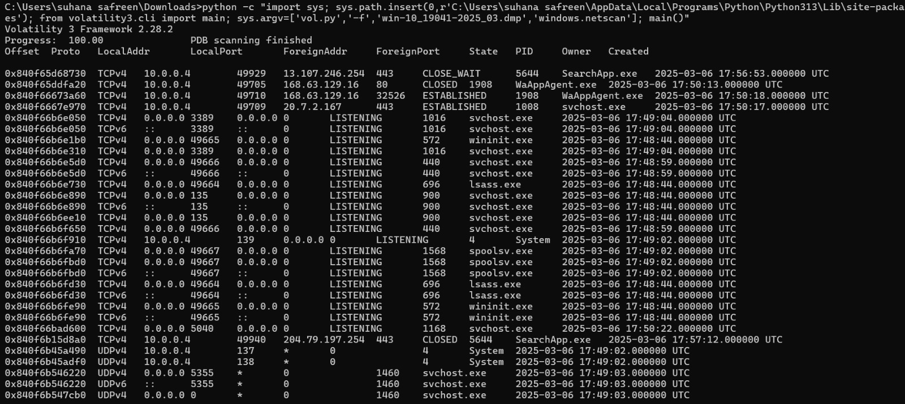
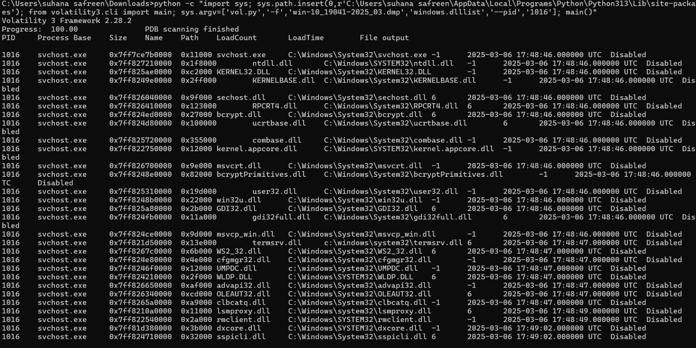

# Volatility Memory Forensics Analysis

## 1. Project Overview

This project demonstrates a basic memory-forensics investigation using **Volatility 3** to analyze a Windows memory image. The investigation focused on identifying running processes, analyzing process relationships, reviewing network connections, examining loaded DLLs, and assessing potentially suspicious activity.

**Project:** Gray Sentinel Day 2
**Focus:** Memory Forensics & Incident Response
**Tool:** Volatility 3 Framework 2.28.2
**Operating System:** Windows 10
**Memory Image:** Windows 10 Build 19041 memory image

> **Note:** The memory image used in this project is a publicly available Windows test image from the Volatility Foundation and was used for educational and portfolio purposes.

---

## 2. Objectives

The objectives of this investigation were to:

* Identify running processes in the memory image.
* Analyze parent-child process relationships.
* Examine active and listening network connections.
* Analyze loaded DLLs for a relevant process.
* Identify potentially suspicious processes or activity.
* Correlate process, network, and DLL evidence.
* Document the investigation using a basic incident-response workflow.

---

## 3. Tools Used

* **Volatility 3 Framework 2.28.2**
* Windows memory image
* Windows process analysis
* Network connection analysis
* DLL analysis
* Basic incident-response methodology

---

## 4. Investigation Methodology

The investigation followed the following memory-forensics workflow:

```text
Memory Image
     ↓
System Identification
     ↓
Process Enumeration
     ↓
Process Tree Analysis
     ↓
Network Connection Analysis
     ↓
Loaded DLL Analysis
     ↓
Evidence Correlation
     ↓
Suspicious Activity Assessment
     ↓
Final Findings
```

---

## 5. Memory Image Identification

The `windows.info` plugin was used to identify the operating system and memory-layer information.

### Key observations

* Windows build: `19041`
* Architecture: `64-bit`
* Memory layer: `WindowsCrashDump64Layer`
* System root: `C:\Windows`
* System time: `2025-03-06 17:59:20 UTC`
* Volatility version: `3 Framework 2.28.2`

### Evidence



---

## 6. Running Process Analysis

The `windows.pslist` plugin was used to enumerate processes present in memory.

Several expected Windows and system processes were identified, including:

* `services.exe`
* `svchost.exe`
* `lsass.exe`
* `MsMpEng.exe`
* `explorer.exe`
* `sshd.exe`
* `WindowsAzureGuestAgent`
* `SearchIndexer.exe`
* `spoolsv.exe`
* `WmiPrvSE.exe`

The process names and executable locations reviewed during the investigation did not provide sufficient evidence to classify a process as malicious.

### Evidence



---

## 7. Process Tree Analysis

The `windows.pstree` plugin was used to examine parent-child process relationships.

A relevant relationship was identified around PID **1016**:

```text
services.exe
    └── svchost.exe (PID 1016)
            └── rdpclip.exe (PID 4180)
```

The investigated `svchost.exe` executable was located at:

```text
C:\Windows\System32\svchost.exe
```

The `rdpclip.exe` process was also located under the expected Windows System32 directory.

This parent-child relationship was consistent with legitimate Windows Remote Desktop functionality and did not by itself indicate process masquerading.

### Evidence



---

## 8. Network Connection Analysis

The `windows.netscan` plugin was used to identify network connections and listening services.

A notable observation was TCP port **3389**, commonly associated with Remote Desktop Protocol (RDP).

Observed activity included:

```text
0.0.0.0:3389
LISTENING

10.0.0.4:3389
    ↓
10.1.130.4:41982
ESTABLISHED
```

An SSH service was also identified listening on TCP port **22** through `sshd.exe`.

The presence of RDP or SSH does not by itself indicate malicious activity. These services were documented as **security-relevant observations** requiring additional contextual investigation.

### Evidence



---

## 9. Loaded DLL Analysis

The `windows.dlllist` plugin was used against PID **1016 (`svchost.exe`)**.

The process loaded numerous DLLs from expected Windows system directories.

Important RDP-related DLLs identified included:

* `termsrv.dll`
* `rdpcorets.dll`
* `RDPSERVERBASE.dll`
* `RDPBASE.dll`
* `credssp.dll`
* `tspkg.dll`

These DLLs were loaded from paths under:

```text
C:\Windows\System32\
```

The presence of RDP-related DLLs correlated with the RDP network activity identified during the `netscan` analysis.

No obviously suspicious DLL path was identified during this review.

### Evidence



---

## 10. Evidence Correlation

The investigation correlated evidence from multiple Volatility plugins rather than relying on a single indicator.

| Evidence Source   | Observation                     | Interpretation                             |
| ----------------- | ------------------------------- | ------------------------------------------ |
| `windows.pslist`  | Normal Windows/system processes | No definitive malicious process identified |
| `windows.pstree`  | `svchost.exe` → `rdpclip.exe`   | Consistent with RDP functionality          |
| `windows.netscan` | TCP 3389 listening/established  | Security-relevant RDP activity             |
| `windows.netscan` | TCP 22 listening                | SSH service identified                     |
| `windows.dlllist` | RDP-related DLLs                | Consistent with Windows RDP functionality  |
| DLL paths         | `C:\Windows\System32\`          | Expected Windows system location           |

---

## 11. Suspicious Process Assessment

The investigation specifically reviewed process names, executable paths, parent-child relationships, network activity, and loaded DLL locations.

No process provided sufficient evidence to be classified as definitively malicious.

The investigated `svchost.exe` process:

```text
PID: 1016
Path: C:\Windows\System32\svchost.exe
```

had a process relationship and DLL set consistent with Remote Desktop functionality.

Therefore, the investigation did **not** identify a confirmed malicious process in the analyzed memory image.

---

## 12. Security-Relevant Findings

### Finding 1 — RDP Activity

TCP port **3389** was observed in a listening state, with an established connection also identified.

**Assessment:** Security-relevant observation.

In a real-world environment, the activity should be validated against:

* Authorized administrative activity
* RDP authentication logs
* Source IP address
* User/account activity
* Successful and failed logon events
* Expected system configuration

### Finding 2 — SSH Service

TCP port **22** was observed listening through:

```text
C:\Program Files\OpenSSH\sshd.exe
```

**Assessment:** Security-relevant service requiring contextual validation.

The presence of SSH alone does not establish malicious activity.

### Finding 3 — RDP-Related DLLs

Multiple RDP-related DLLs were loaded by PID 1016 from:

```text
C:\Windows\System32\
```

**Assessment:** Consistent with legitimate Windows Remote Desktop functionality.

---

## 13. Incident Response Recommendations

If this were a real enterprise investigation, the following additional evidence should be reviewed:

1. Review Windows Security Event Logs for successful and failed RDP logons.
2. Identify the account associated with the RDP connection.
3. Determine whether the source IP was authorized.
4. Review unusual authentication patterns.
5. Correlate RDP activity with endpoint and network telemetry.
6. Review SSH authentication logs and configuration.
7. Investigate any unexpected administrative access.
8. Preserve relevant evidence before making containment changes.

---

## 14. Volatility Commands Used

The following Volatility plugins were used during the investigation:

```text
windows.info
windows.pslist
windows.pstree
windows.netscan
windows.dlllist --pid 1016
```

The Volatility executable was invoked through Python during the analysis environment.

---

## 15. Skills Demonstrated

* Memory forensics
* Windows process analysis
* Process-tree analysis
* Network connection analysis
* DLL investigation
* Evidence correlation
* Incident-response methodology
* Suspicious activity assessment
* Security investigation documentation

---

## 16. Project Evidence

Screenshots documenting the investigation are stored in the `screenshots` directory.

```text
screenshots/
├── 01-memory-info.png
├── 02-running-processes.png
├── 03-network-connections.png
├── 04-process-tree.png
└── 05-loaded-dlls.png
```

---

## 17. Five-Line Summary

Volatility 3 was used to analyze a Windows memory image and enumerate running processes, network connections, and loaded DLLs.
Process-tree analysis showed expected Windows service relationships, including `svchost.exe` associated with Remote Desktop functionality.
Network analysis identified an active RDP connection on TCP port 3389 and an SSH service listening on TCP port 22.
DLL analysis identified RDP-related Windows DLLs loaded from the expected `C:\Windows\System32\` directory, with no definitive malicious process identified.
The investigation demonstrates the importance of correlating process, network, process-tree, and memory-resident DLL evidence during incident response.

---

## 18. Conclusion

This project demonstrates a basic memory-forensics investigation using Volatility 3.

The analysis covered process enumeration, process-tree analysis, network connection analysis, and loaded DLL investigation. The evidence did not provide sufficient grounds to identify a confirmed malicious process.

The primary security-relevant observation was RDP activity on TCP port 3389. The associated process and DLL evidence was consistent with legitimate Windows Remote Desktop functionality.

The investigation demonstrates the importance of **correlating multiple sources of forensic evidence before determining whether activity is suspicious**.
